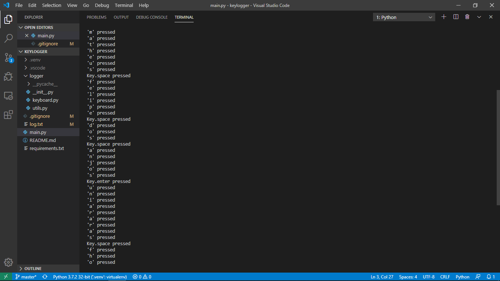
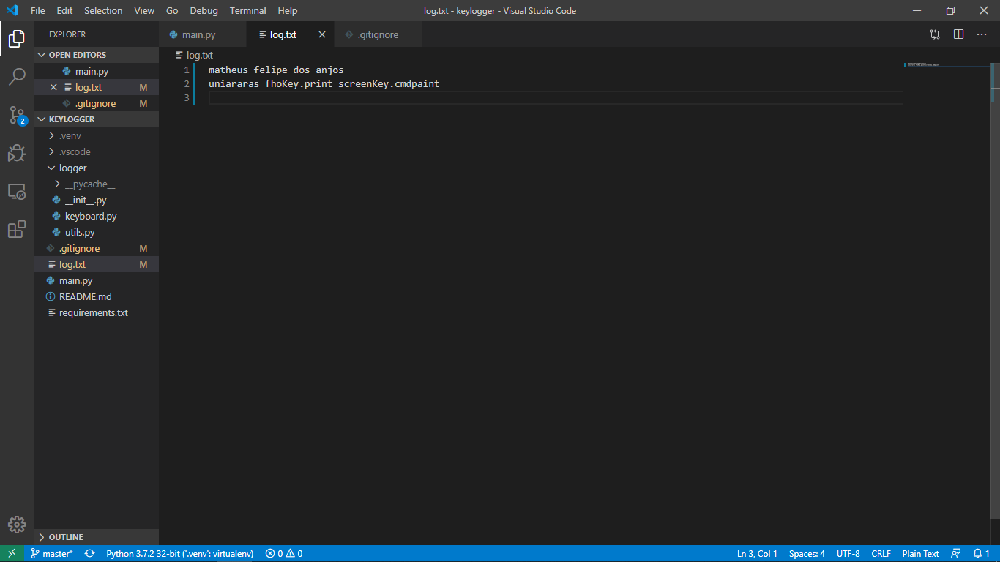

# KeyLogger

Keylogger project for subject of Information Security of the specialization in Data Science at University FHO Uniararas.

## How to run
This application was developed using Python 3.7.  
First install the library `pynput` available in `requirements.txt` file and then run the `main.py` afterwards.  

## Typping keyboard

The keystrokes are printed (above) on terminal and saved into a file (below) by default called `log.txt`.

## EXE
Use `auto-py-to-exe` pip package to generate an EXE file using `onefile.pyw`.